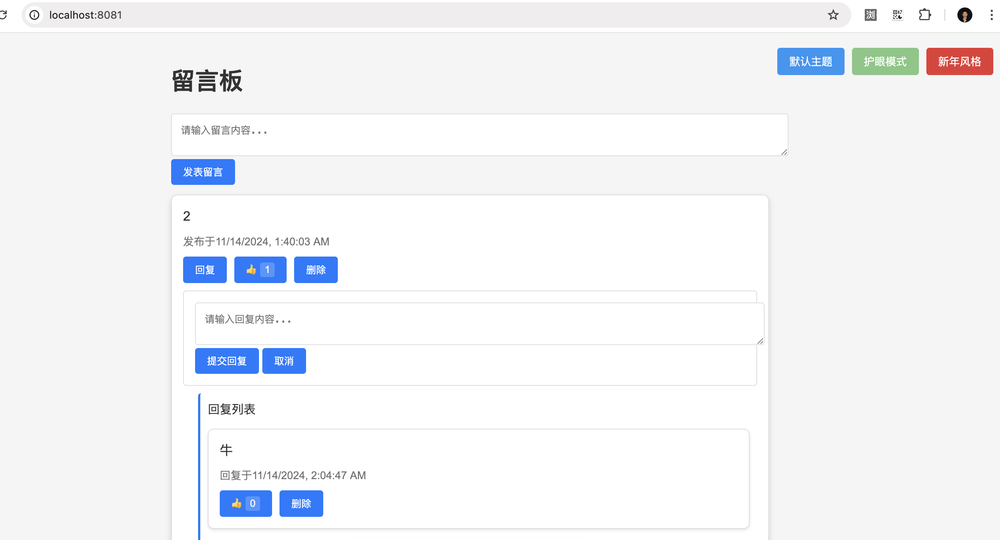
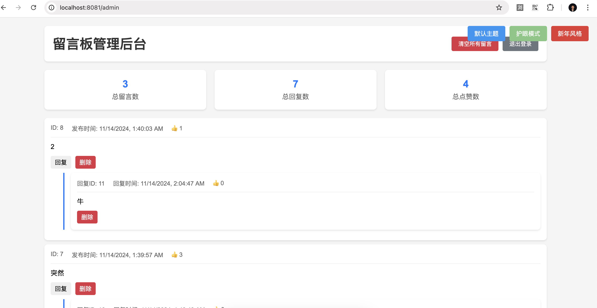

# Message Board Application

A Spring Boot based message board system that allows users to post and manage messages.

[中文文档](README_CN.md)

## Screenshots

### Frontend Interface


### Admin Dashboard


## Features

- User message posting
- Admin message management
- Message filtering and moderation
- RESTful API support
- Spring Security integration

## Technical Stack

- Java 17
- Spring Boot 3.x
- Spring Data JPA
- Spring Security
- MySQL/PostgreSQL
- Maven
- Docker

## Quick Start

1. Clone the repository:
```bash
git clone git@github.com:guomengtao/spring-docker-board.git
```

2. Start with Docker:
```bash
docker-compose up --build
```

3. Access:
- Frontend: http://localhost:8081
- Admin Panel: http://localhost:8081/admin
  - Username: admin
  - Password: admin123

### Manual Deployment

Requirements:
- JDK 17+
- Maven 3.8+
- MySQL 8.0+

Steps:
1. Configure database
2. Modify configuration files
3. Build: `mvn clean package`
4. Run: `java -jar target/message-board-1.0.0.jar`

## 📚 Usage Guide

### Regular Users
- Post messages
- Reply to messages
- Like messages
- Switch themes

### Administrators
- View statistics
- Manage messages
- Bulk delete
- Reply to messages

## 🔧 Configuration

### Environment Variables
```properties
# Database
SPRING_DATASOURCE_URL=jdbc:mysql://db:3306/message_board
SPRING_DATASOURCE_USERNAME=root
SPRING_DATASOURCE_PASSWORD=123456

# Port
SERVER_PORT=8081
```

### Data Storage
Using Docker volume:
```yaml
volumes:
  mysql_data:
```

## 🛡️ Security Notes

1. Change default passwords
2. Backup data
3. Use HTTPS
4. Restrict database access

## 🤝 Contributing

1. Fork the project
2. Create your feature branch
3. Commit your changes
4. Push to the branch
5. Create a Pull Request

## 📝 Changelog

### v1.0.0 (2024-01-14)
- 🎉 Initial release
- Basic features
- Admin dashboard
- Docker support
- Theme switching
- Demo data

## 📄 License

[MIT License](LICENSE)

## 🙏 Acknowledgments

- Spring Boot
- MySQL
- Docker
- Bootstrap