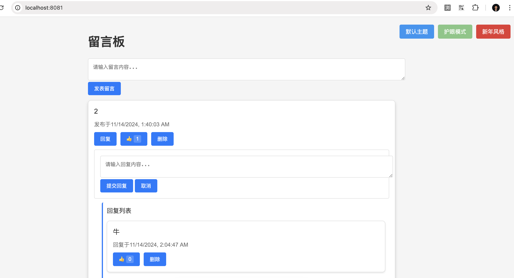
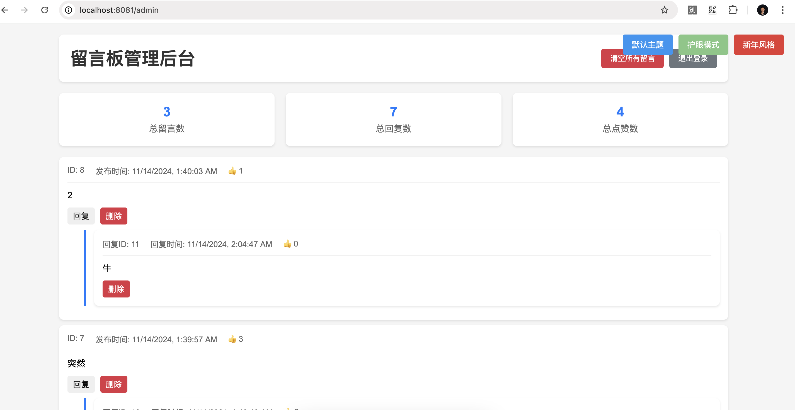

# 留言板应用

基于Spring Boot的留言板系统，支持用户发布和管理留言。

## 演示截图

### 前台界面


### 管理后台


## 功能特点

- 用户留言发布
- 管理员留言管理
- 留言过滤和审核
- RESTful API支持
- Spring Security集成

## 技术栈

- Java 17
- Spring Boot 3.x
- Spring Data JPA
- Spring Security
- MySQL/PostgreSQL
- Maven
- Docker

## 快速开始

### 方式一：使用Docker（推荐）
```bash
# 这将启动所有需要的容器
docker-compose up --build
```

### 方式二：手动部署（不使用Docker）
环境要求：
- JDK 17+
- Maven 3.8+
- MySQL 8.0+（本地运行）

步骤：
1. 本地配置MySQL数据库
2. 更新application.properties中的数据库配置
3. 构建应用：
```bash
mvn clean package
```
4. 运行JAR文件：
```bash
java -jar target/message-board-1.0.0.jar
```

注意：方式二需要手动设置MySQL，不使用容器。

## 📚 使用说明

### 普通用户
- 发表留言
- 回复留言
- 点赞
- 切换主题

### 管理员
- 查看统计
- 管理留言
- 批量删除
- 回复留言

## 🔧 配置说明

### 环境变量
```properties
# 数据库
SPRING_DATASOURCE_URL=jdbc:mysql://db:3306/message_board
SPRING_DATASOURCE_USERNAME=root
SPRING_DATASOURCE_PASSWORD=123456

# 端口
SERVER_PORT=8081
```

### 数据存储
使用 Docker volume：
```yaml
volumes:
  mysql_data:
```

## 🛡️ 安全提示

1. 修改默认密码
2. 备份数据
3. 使用HTTPS
4. 限制数据库访问

## 🤝 参与贡献

1. Fork项目
2. 创建分支
3. 提交代码
4. 发起PR

## 📝 更新记录

### v1.0.0 (2024-01-14)
- 🎉 首次发布
- 基础功能
- 管理后台
- Docker支持
- 主题切换
- 演示数据

## 📄 开源协议

[MIT License](LICENSE)

## 🙏 鸣谢

- Spring Boot
- MySQL
- Docker
- Bootstrap